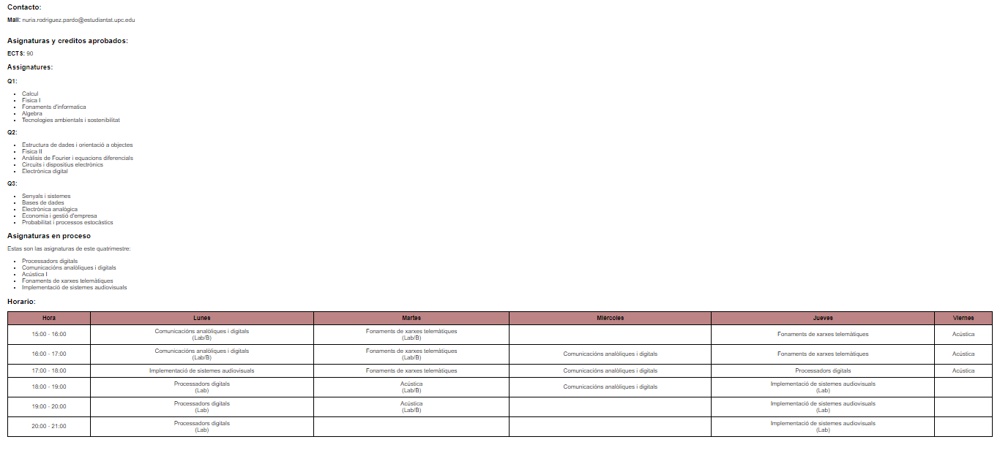

# Practica 3A: WiFi Pagina Web
## Objetivos: 
- Conectarse a una red WiFi
- Crear un servidor con una pagina Web HTML.
## Materiales: 
- ESP32-S3 
- **Librerias:**
```ini
    lib_deps = 
        me-no-dev/AsyncTCP@^1.1.1
        ottowinter/ESPAsyncWebServer-esphome@^3.1.0
```
## Procedimiento: 
### Programa:
**Codigo:**
```cpp
    #include <WiFi.h>
    #include <SPIFFS.h>
    #include <AsyncTCP.h>
    #include <WebServer.h>
    #include <Arduino.h>

    const char* ssid = "RedmiNuria";
    const char* password = "Patata123";


    WebServer server;

    String webContent; 

    void handle_root() {
    server.send(200, "text/html", webContent);
    }

    String loadFile(String fileName) { 
    File file = SPIFFS.open(fileName);
    String content = "";

    if (!file) {
        Serial.println("Error al abrir el archivo");
        return content;
    }

    while (file.available()) {
        char c = file.read();
        content += c;
    }

    file.close();
    return content;
    }

    void setup() {
    Serial.begin(115200);

    if (!SPIFFS.begin(true)) {
        Serial.println("Error al montar SPIFFS");
        return;
    }

    webContent = loadFile("/PaginaWeb.html");
    delay(1000);

    Serial.println("Conectando a la red WiFi...");
    Serial.println(ssid);
    WiFi.begin(ssid, password);
    while (WiFi.status() != WL_CONNECTED) {
        delay(1000);
        Serial.print(".");
    }
    Serial.println("");
    Serial.println("Conexión WiFi establecida");
    Serial.print("Dirección IP: ");
    Serial.println(WiFi.localIP());

    server.begin();
    Serial.println("Servidor HTTP iniciado");
    
    server.on("/", handle_root);
    }

    void loop() {
    server.handleClient();
    }
```
**Descripción:**<br>
Primero, es necesario conectarse a una red WiFi, seguido de la declaración del objeto ""WebServer" que se utilizará para manejar las solicitudes HTTP entrantes. <br>
La función "handle_root()" maneja dichas solicitudes al directorio raíz ("/") y envía el contenido de la página web al cliente que realiza la solicitud. <br>
Más tarde, se cargará el contenido  HTML de un archivo llamado "PaginaWeb.html" que se encuentra en una carpeta llamada "data" (que detallaré más tarde).<br>
Una vez en el setup(), se inicializan los componentes necesarios, se monta el sistema SPIFFS, se carga el contenido de la página web des de un archivo, se conecta a la red WiFi utilizando las credenciales proporcionadas y se inicia el servidor web. 
El bucle loop() se encarga de manejar las solicitudes de los clientes. Tenemos el método handleClient(), que és lo que las maneja. 

### Pagina Web: 
**Codigo:**
```html
    <title>Pagina Web Núria:</title>

        <html lang="es">
    <head>
        <meta charset="UTF-8">
        <meta name="viewport" content="width=device-width, initial-scale=1.0">
        <title>Mi Página Web</title>
        <style>
                body {
                    font-family: Arial, sans-serif; /* Letra Arial */
                    color: #000000; /* Color de texto negro */
                    margin: 20px; /* Margen exterior */
                    padding: 0;
                }   

                h1 {
                    font-size: 24px; /* Tamaño de fuente para h1 */
                    font-family: Arial, sans-serif; /* Letra Arial para h1 */
                }

                h2 {
                    font-size: 20px; /* Tamaño de fuente para h2 */
                    font-family: Arial, sans-serif; /* Letra Arial para h2 */
                }

                .custom-button {
                    background-color: #3D2F0B; /* Marrón oscuro */
                    color: white; /* Letras blancas */
                    text-align: center; /* Texto centrado */
                    padding: 10px 20px; /* Espaciado interior del botón */
                    border: none; /* Sin borde */
                    border-radius: 5px; /* Bordes redondeados */
                    cursor: pointer; /* Cursor al pasar sobre el botón */
                    display: block; /* Hacer que el botón ocupe todo el ancho disponible */
                    margin: 0 auto; /* Centrar el botón horizontalmente */
                    width: 200px; /* Ancho del botón */
                    font-size: 16px; /* Tamaño de la fuente */
                    font-weight: bold; /* Texto en negrita */
                    text-decoration: none; /* Sin subrayado */
                    transition: background-color 0.3s ease; /* Transición suave del color de fondo */
                }

            .custom-button:hover {
                background-color: #5D4E36; /* Marrón oscuro más claro al pasar el ratón */
            }   

            table {
                width: 100%;
                border-collapse: collapse;
            }
            th, td {
                border: 1px solid black;
                padding: 8px;
                text-align: center;
            }
            th {
                background-color: #bc8484;
            }
        </style>
    </head>
        
    <body>
        <h2>Contacto:</h2>
        <p><strong>Mail:</strong> nuria.rodriguez.pardo@estudiantat.upc.edu 
        <br><br>
        <h2>Asignaturas y creditos aprobados: </h2>
        <strong>ECTS:</strong> 90 <br>
        <h3>Assignatures: </h3>
        <strong>Q1: </strong>
        <ul>
            <li> Calcul </li>
            <li> Fisica I</li>
            <li> Fonaments d'informatica </li>
            <li> Algebra </li>
            <li> Tecnologies ambientals i sostenibilitat </li>
        </ul>
        <strong>Q2: </strong>
        <ul>
            <li> Estructura de dades i orientació a objectes </li>
            <li> Fisica II</li>
            <li> Anàlisis de Fourier i equacions diferencials </li>
            <li> Circuits i dispositius electrònics </li>
            <li> Electrònica digital </li>
        </ul>
        <strong>Q3: </strong>
        <ul>
            <li> Senyals i sistemes </li>
            <li> Bases de dades </li>
            <li> Electrònica analògica </li>
            <li> Economia i gestió d'empresa </li>
            <li> Probabilitat i processos estocàstics </li>
        </ul>
        <h2> Asignaturas en proceso</h2>
        Estas son las asignaturas de este quatrimestre: 
        <ul>
            <li> Processadors digitals </li>
            <li> Comunicacións analòliques i digitals</li>
            <li> Acústica I </li>
            <li> Fonaments de xarxes telemàtiques </li>
            <li> Implementació de sistemes audiovisuals </li>
        </ul>
        </p>
        <h2>Horario: </h2>
        
        <table>
            <tr>
            <th>Hora</th>
            <th>Lunes</th>
            <th>Martes</th>
            <th>Miércoles</th>
            <th>Jueves</th>
            <th>Viernes</th>
            </tr>
            <tr>
            <td>15:00 - 16:00</td>
            <td>Comunicacións analòliques i digitals <br> (Lab/B)</td>
            <td>Fonaments de xarxes telemàtiques <br> (Lab/B)</td>
            <td></td>
            <td>Fonaments de xarxes telemàtiques</td>
            <td>Acústica</td>
            </tr>
            <tr>
            <td>16:00 - 17:00</td>
            <td>Comunicacións analòliques i digitals <br> (Lab/B)</td>
            <td>Fonaments de xarxes telemàtiques <br> (Lab/B)</td>
            <td>Comunicacións analòliques i digitals</td>
            <td>Fonaments de xarxes telemàtiques</td>
            <td>Acústica</td>
            </tr>
            <tr>
            <td>17:00 - 18:00</td>
            <td>Implementació de sistemes audiovisuals</td>
            <td>Fonaments de xarxes telemàtiques</td>
            <td>Comunicacións analòliques i digitals</td>
            <td>Processadors digitals</td>
            <td>Acústica</td>
            </tr>
            <tr>
            <td>18:00 - 19:00 </td>
            <td>Processadors digitals <br> (Lab)</td>
            <td>Acústica <br> (Lab/B)</td>
            <td>Comunicacións analòliques i digitals</td>
            <td>Implementació de sistemes audiovisuals <br> (Lab)</td>
            <td></td>
            </tr>
            <tr>
            <td>19:00 - 20:00</td>
            <td>Processadors digitals <br> (Lab)</td>
            <td>Acústica <br> (Lab/B)</td>
            <td></td>
            <td>Implementació de sistemes audiovisuals <br> (Lab)</td>
            <td></td>
            </tr>
            <tr>
            <td>20:00 - 21:00</td>
            <td>Processadors digitals <br> (Lab)</td>
            <td></td>
            <td></td>
            <td>Implementació de sistemes audiovisuals <br> (Lab)</td>
            <td></td>
            </tr>
        </table>
        
        </body>
        </html>
    </body>
```
**Ejemplo:**<br>


**Salida de la terminal:**<br>
```
    Conectando a la red WiFi...
    RedmiNuria
    .
    Conexión WiFi establecida
    Dirección IP: 192.168.97.26
    Servidor HTTP iniciado
```
## Conclusión: 
Configura un servidor web básico que sirve una página web almacenada en el sistema de archivos SPIFFS cuando recibe solicitudes HTTP en el directorio raíz.
